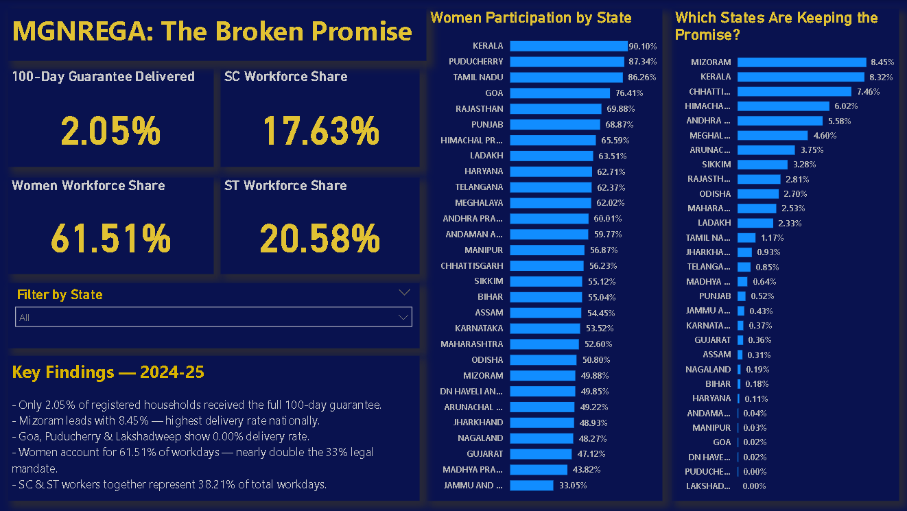

# MGNREGA: The Broken Promise 📊
### Analyzing India's Rural Employment Guarantee Scheme — 2024-25

---

## 🔍 Project Question
MGNREGA guarantees 100 days of paid work to every registered rural household in India.  
**How many households are actually receiving that guarantee — and who is being left behind?**

---

## 📁 Data Source
- **Source:** MGNREGA Public Data Portal — Ministry of Rural Development, Government of India
- **Dataset:** District-wise MGNREGA Data, 2024-25 (Mendeley Data Repository)
- **Coverage:** 620 districts across 30 states and union territories
- **Period:** Financial Year 2024-25 (March figures used as cumulative year-end totals)
- **Link:** https://data.mendeley.com/datasets/2ksgkp3crh/1

---

## 🛠️ Tools Used
- **Power BI Desktop** — Dashboard design and visualization
- **DAX** — Custom measures and calculations
- **Power Query** — Data filtering and transformation

---

## 📊 Key Findings

| Metric | Value |
|--------|-------|
| Households receiving full 100-day guarantee | **2.05%** |
| Women workforce share (legal mandate: 33%) | **61.51%** |
| SC workforce share | **17.63%** |
| ST workforce share | **20.58%** |

- Only **2.05%** of registered households received the full 100-day employment guarantee
- **Mizoram** leads nationally with 8.45% delivery rate
- **Lakshadweep** shows 0.00% delivery rate. Puducherry, Goa and DN Haveli all below 0.05%
- Women account for **61.51%** of total workdays — nearly double the 33% legal mandate
- SC and ST workers together represent **38.21%** of total workdays

---

## 📸 Dashboard Preview



---

## 📐 Custom Measures Created

```DAX
100_Day_Delivery_Rate = 
DIVIDE(
    SUM(MGNREGA[Total_No_of_HHs_completed_100_Days_of_Wage_Employment]),
    SUM(MGNREGA[Total_No_of_JobCards_issued])
)
```

This metric does not exist in the raw data — it was derived to measure the gap between registered households and those actually receiving the guaranteed benefit.

---

## ⚠️ Data Limitations
- Dataset covers only one financial year (2024-25) — trend analysis across years was not possible
- Data does not capture why households did not receive the full 100 days — reasons such as lack of awareness, delayed wages, or administrative barriers would require separate survey data
- Some district-level entries had missing or zero values

---

## 💡 What I Would Do With More Data
- Add 3-5 years of data to show whether delivery rates are improving or worsening over time
- Cross-reference with state-level poverty and BPL population data to identify which poorest districts are being reached least
- Compare wage payment timelines across states to identify administrative bottlenecks

---

## 📂 Files in This Repository
| File | Description |
|------|-------------|
| `MGNREGA_Broken_Promise_2024_25.pbix` | Power BI dashboard file |
| `MGNREGA_Dashboard_Screenshot.png` | Dashboard screenshot |
| `README.md` | Project documentation |

---

*Data sourced from official Government of India portal. All analysis is independent and for portfolio purposes only.*
